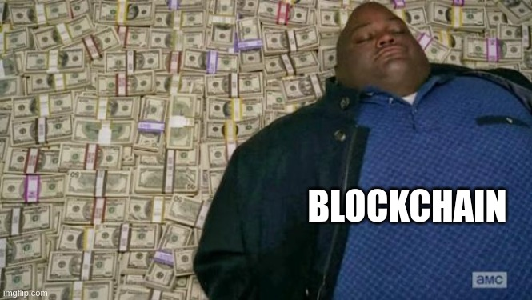

# Convince-Coin

    

In the most fundamental sense, what does the blockchain technology enable us to do? Behind all the complexities of ditributed systems and complex mathematical equations, the main aim of a blockchain is to remove single authority. Every action that is performed in the blockchain needs to be verified by other nodes/computers in the system. This type of concensus is sometimes called Proof of Stake. It is only once a "proof of stake" has been achieved that you can consider you action to be complete.

## Learnings
One of the things that I struggled with in the initial part of the course was the ability to guide the team towards my vision of how things should be. I later realized that in a well-functioning team, the idea of "my way or the high way" simply doesn't work. However, the ability to convince other people by properly bringing them in on your vision is still very important. In this regard, I learned the following things:
1. Whenever you are presenting your vision about something, you should make sure you get the "Proof of Stake" from all your team members. This has two benefits: first, that everyone feels engaged in the project; and second, everyone feels welcome improve the initial idea because no idea is perfect and there is always room for improvement.
2. A right mix of emotion and facts is required to convince anyone of anything. Initially, my approach towards convincing had been more focused on the facts but I realized that emotional component of the equation is not only required but is more important than the facts. Throughout the course I practiced having a balance of both of these aspects in my contributions to group meetings.
3. Whenever you are trying to convince someone of something, it is possible that the other person will come up with a different idea that captures the essence of your idea and makes it even better. In a conversion, you need to be open to this possibility. I realize that this may as well be the very definition of co-creation but this had been my blindspot for a very long time and as a result of this course, I've begun to improve on this front.

